# 🎯 나만의 퀴즈 게임 (Python Quiz Game)

터미널에서 동작하는 객체지향 기반 퀴즈 게임입니다. Python 기본 문법(변수/조건문/반복문/함수), 클래스,
JSON 파일 입출력을 직접 사용해 처음부터 끝까지 구현했습니다.

## 1. 프로젝트 개요

- 실행 시 메뉴에서 번호를 선택해 퀴즈를 풀고, 새로운 퀴즈를 등록하고, 등록된 퀴즈 목록과 최고 점수를
  확인할 수 있는 콘솔 프로그램입니다.
- 사용자가 추가한 퀴즈와 최고 점수는 `state.json` 파일에 저장되어, 프로그램을 종료했다가 다시 실행해도
  그대로 유지됩니다. (데이터 영속성)
- 기능은 최소 2개 이상의 클래스로 역할을 나누어 구현했습니다. `Quiz`는 "문제 하나"만 알고 있고,
  `QuizGame`은 "게임을 어떻게 진행할지"만 알고 있도록 책임을 분리했습니다.

  | 클래스 | 책임 | 주요 속성 | 주요 메서드 |
  | --- | --- | --- | --- |
  | `Quiz` (`quiz.py`) | 문제 1개를 표현 | `question`, `choices`, `answer`, `hint` | `display()`, `is_correct()`, `show_hint()`, `to_dict()` / `from_dict()` |
  | `QuizGame` (`quiz_game.py`) | 메뉴 진행, 게임 흐름, 파일 저장/불러오기 | `quizzes`, `best_score`, `history` | `run()`, `play_quiz()`, `add_quiz()`, `list_quizzes()`, `delete_quiz()`, `show_best_score()`, `load_state()` / `save_state()` |

## 2. 퀴즈 주제와 선정 이유

**주제: IT/컴퓨터 상식**

컴퓨터공학 입학연수 과정에서 Python과 Git을 배우는 김에, 앞으로 계속 마주치게 될 IT 기본 개념
(HTTP 상태 코드, CPU, 비트/바이트, RDBMS, Git 명령어, 운영체제 등)을 퀴즈로 만들어 스스로
복습하면 좋겠다고 생각해 이 주제를 선택했습니다. 프로그래밍 문법을 익히는 동시에 배경지식도
같이 정리할 수 있어 일석이조라고 판단했습니다.

## 3. 실행 방법

Python 3.10 이상이 필요합니다. (개발 환경: Python 3.11) 외부 라이브러리 없이 표준 라이브러리만
사용합니다.

```bash
git clone https://github.com/NamJungHyeon/python-quiz-game.git
cd python-quiz-game
python3 main.py
```

실행하면 저장된 `state.json`을 읽어 아래와 같은 안내와 함께 메뉴가 뜹니다. (파일이 없으면
`data.py`의 기본 퀴즈 16문항으로 시작합니다.)

```
📂 저장된 데이터를 불러왔습니다. (퀴즈 16개, 최고점수 없음)
========================================
        🎯 나만의 퀴즈 게임 🎯
========================================
1. 퀴즈 풀기
2. 퀴즈 추가
3. 퀴즈 목록
4. 점수 확인
5. 퀴즈 삭제
6. 종료
========================================
선택:
```

## 4. 기능 목록

| 메뉴 | 기능 | 설명 |
| --- | --- | --- |
| 1 | 퀴즈 풀기 | 풀 문제 수를 선택하면, 등록된 퀴즈 중 해당 개수만큼 무작위로 뽑아 랜덤한 순서로 출제합니다. 정답 여부를 즉시 알려주고, 종료 후 점수와 최고 점수 갱신 여부를 보여줍니다. 등록된 퀴즈가 없으면 안내 후 메뉴로 돌아갑니다. |
| 2 | 퀴즈 추가 | 문제, 선택지 4개, 정답 번호(1~4), 힌트(선택)를 입력받아 새 퀴즈를 등록하고 즉시 파일에 저장합니다. |
| 3 | 퀴즈 목록 | 현재 등록된 모든 퀴즈의 문제 목록을 번호와 함께 출력합니다. 퀴즈가 없으면 안내 메시지를 보여줍니다. |
| 4 | 점수 확인 | 최고 점수와 최근 게임 기록(최대 5개, 최신순)을 함께 보여줍니다. 아직 한 번도 풀지 않았다면 안내 메시지를 보여줍니다. |
| 5 | 퀴즈 삭제 | 번호를 선택해 등록된 퀴즈를 삭제하고 파일에 반영합니다. |
| 6 | 종료 | 현재 상태를 저장하고 프로그램을 종료합니다. |

기본 제공 퀴즈는 `data.py`에 IT/컴퓨터 상식 주제로 16문항(요구 조건인 5개 이상)이 등록되어 있습니다.

### 4-1. 퀴즈 풀기 — 상세 동작과 예시

1. 등록된 퀴즈가 하나도 없으면 `⚠️ 등록된 퀴즈가 없습니다. 먼저 퀴즈를 추가해주세요.`를 출력하고
   바로 메뉴로 돌아갑니다.
2. 등록된 퀴즈가 2개 이상이면 몇 문제를 풀지 먼저 물어봅니다(범위: 1 ~ 등록된 퀴즈 수). 퀴즈가
   1개뿐이면 묻지 않고 그 1문제로 바로 진행합니다.
3. `random.sample(self.quizzes, total)`로 문제를 중복 없이 무작위 추출하므로, 같은 문제도 매번
   다른 순서로 출제됩니다.
4. 각 문제마다 정답 번호(1~4) 또는 힌트 보기(`0`)를 입력받습니다. `0`을 입력하면 힌트를 보여주고
   다시 같은 문제의 정답을 입력받습니다.
5. 모든 문제를 풀면 정답률로 점수를 계산하고(자세한 계산식은 [5. 점수 계산 방식](#5-점수-계산-방식)
   참고), 최고 점수보다 높으면 갱신하며, 이번 결과를 게임 기록(`history`)에 추가한 뒤 파일에
   저장합니다.

```
선택: 1

몇 문제를 풀까요? (1-6): 2

📝 퀴즈를 시작합니다! (총 2문제, 힌트 보기: 0 입력)
----------------------------------------

[문제 1]
컴퓨터의 중앙처리장치를 가리키는 약자는?

1. RAM
2. CPU
3. GPU
4. SSD

정답 입력 (힌트 보기: 0): 0
💡 힌트: 컴퓨터의 '두뇌'라고 불리는 장치입니다.

정답 입력 (힌트 보기: 0): 2
✅ 정답입니다!
----------------------------------------

[문제 2]
1바이트(Byte)는 몇 비트(bit)로 이루어져 있는가?

1. 4비트
2. 8비트
3. 16비트
4. 32비트

정답 입력 (힌트 보기: 0): 3
❌ 오답입니다. 정답은 2번입니다.

========================================
🏆 결과: 2문제 중 1문제 정답! (45점, 힌트 1회 사용)
🎉 새로운 최고 점수입니다!
========================================
```

### 4-2. 퀴즈 추가 — 상세 동작과 예시

문제, 선택지 4개, 정답 번호를 순서대로 입력받습니다. 힌트는 선택 사항이라 그냥 Enter를 누르면
`null`(힌트 없음)로 저장됩니다. 입력이 끝나면 즉시 `state.json`에 저장되므로, 추가 직후 프로그램이
종료돼도 데이터가 남습니다.

```
선택: 2

📌 새로운 퀴즈를 추가합니다.
문제를 입력하세요: TCP와 UDP 중 연결 지향(connection-oriented) 프로토콜은?
선택지 1: TCP
선택지 2: UDP
선택지 3: ICMP
선택지 4: ARP
정답 번호 (1-4): 1
힌트 (선택 사항, 없으면 Enter): 3-way handshake로 연결을 맺습니다.

✅ 퀴즈가 추가되었습니다!
```

### 4-3. 퀴즈 목록

```
선택: 3

📋 등록된 퀴즈 목록 (총 16개)
----------------------------------------
[1] HTTP 상태 코드 중 '요청한 리소스를 찾을 수 없음'을 의미하는 코드는?
[2] 컴퓨터의 중앙처리장치를 가리키는 약자는?
[3] 1바이트(Byte)는 몇 비트(bit)로 이루어져 있는가?
[4] 다음 중 대표적인 관계형 데이터베이스 관리 시스템(RDBMS)이 아닌 것은?
[5] Git에서 원격 저장소의 변경 사항을 내려받아 현재 브랜치에 병합까지 수행하는 명령어는?
[6] 다음 중 운영체제(OS)가 아닌 것을 고르시오.
...
[16] 프로그램이 더 이상 쓰지 않는 메모리를 계속 점유해 시스템 성능을 점점 떨어뜨리는 문제를 무엇이라 하는가?
----------------------------------------
```

### 4-4. 점수 확인

최고 점수 한 줄과, 이번까지 쌓인 게임 기록 중 최근 5개를 최신순으로 보여줍니다.

```
선택: 4

🏆 최고 점수: 45점 (2문제 중 1문제 정답)

📜 최근 게임 기록 (최신순)
----------------------------------------
- 2026-08-05 10:12:03 | 1/2문제 정답 | 45점, 힌트 1회
----------------------------------------
```

### 4-5. 퀴즈 삭제

목록을 먼저 보여준 뒤 삭제할 번호를 입력받고, 삭제 결과를 파일에 반영합니다.

```
선택: 5

📋 등록된 퀴즈 목록 (총 16개)
----------------------------------------
[1] HTTP 상태 코드 중 '요청한 리소스를 찾을 수 없음'을 의미하는 코드는?
...
----------------------------------------

삭제할 퀴즈 번호 (1-16): 16

🗑️ 삭제되었습니다: 프로그램이 더 이상 쓰지 않는 메모리를 계속 점유해 시스템 성능을 점점 떨어뜨리는 문제를 무엇이라 하는가?
```

### 4-6. 종료

현재 퀴즈 목록, 최고 점수, 게임 기록을 `state.json`에 저장한 뒤 프로그램을 마칩니다.

### 4-7. 공통 입력/예외 처리 (상세)

숫자 입력 · Ctrl+C/EOF · 파일 손상, 세 가지 상황을 각각 어디서 어떻게 처리하는지 실제 코드와
함께 정리했습니다.

**`try/except`가 필요한 이유**: 사용자 입력과 파일 입출력은 디스크 상태, 권한, 입력 스트림 종료
등 프로그램 로직만으로는 통제할 수 없는 외부 요인으로 언제든 실패할 수 있습니다. `try/except` 없이
그냥 처리하면 실패하는 순간 예외가 처리되지 않은 채 프로그램이 즉시 종료되므로, 실패 가능 지점마다
감싸서 안내 메시지를 보여주거나 기본값으로 복구하는 경로를 만들어야 했습니다.

#### (1) 숫자 입력 검증 — 공백 제거 / 변환 실패 / 범위 초과 / 빈 입력

메뉴 선택, 정답 입력, 문제 수 선택 등 숫자를 입력받는 모든 곳에서
`_get_int_input()` 하나를 공통으로 사용합니다. 4가지 케이스를 전부 검사할 때까지 같은 프롬프트를
반복해서 보여줍니다. (`quiz_game.py`)

```python
def _get_int_input(self, prompt, min_value, max_value):
    while True:
        try:
            raw = input(prompt)
        except EOFError:
            self._handle_eof()
        text = raw.strip()                      # ① 앞뒤 공백 제거

        if text == "":                           # ② 빈 입력
            print(f"⚠️ 입력이 없습니다. {min_value}-{max_value} 사이의 숫자를 입력하세요.")
            continue

        if not text.lstrip("-").isdigit():        # ③ 숫자 변환 실패
            print(f"⚠️ 잘못된 입력입니다. {min_value}-{max_value} 사이의 숫자를 입력하세요.")
            continue

        value = int(text)
        if value < min_value or value > max_value:  # ④ 허용 범위 초과
            print(f"⚠️ 잘못된 입력입니다. {min_value}-{max_value} 사이의 숫자를 입력하세요.")
            continue

        return value
```

```
선택: abc
⚠️ 잘못된 입력입니다. 1-6 사이의 숫자를 입력하세요.

선택: 9
⚠️ 잘못된 입력입니다. 1-6 사이의 숫자를 입력하세요.
```

#### (2) `Ctrl+C` / `EOFError` — 저장 후 안전 종료

`Ctrl+C`는 최상위(`main.py`)에서 한 번에 잡고, `EOFError`는 입력을 받는 지점마다
`_handle_eof()`를 호출하도록 했습니다. 두 경우 모두 **종료 전에 반드시 `save_state()`를 먼저
호출**합니다.

```python
# main.py
def main():
    game = QuizGame()
    try:
        game.run()
    except KeyboardInterrupt:
        print("\n\n⚠️ Ctrl+C가 감지되었습니다. 게임을 저장하고 종료합니다.")
        game.save_state()
```

```python
# quiz_game.py
def _handle_eof(self):
    print("\n⚠️ 입력 스트림이 종료되었습니다. 게임을 저장하고 종료합니다.")
    self.save_state()
    raise SystemExit(0)
```

#### (3) `state.json` 없음/손상 — 기본 데이터로 복구

파일이 아예 없으면(최초 실행) 바로 기본 데이터를 쓰고, 파일은 있지만 JSON 형식이 깨졌거나
스키마가 다르면(`JSONDecodeError`, `KeyError`, `TypeError`, `OSError`) 안내 메시지를 출력한 뒤
기본 데이터로 초기화합니다. (`quiz_game.py`)

```python
def load_state(self):
    if not os.path.exists(STATE_FILE):
        self.quizzes = list(DEFAULT_QUIZZES)
        self.best_score = None
        self.history = []
        return

    try:
        with open(STATE_FILE, "r", encoding="utf-8") as f:
            data = json.load(f)
        self.quizzes = [Quiz.from_dict(q) for q in data["quizzes"]]
        self.best_score = data.get("best_score")
        self.history = data.get("history", [])
    except (json.JSONDecodeError, KeyError, TypeError, OSError):
        print("⚠️ 저장된 데이터 파일이 손상되어 기본 퀴즈 데이터로 초기화합니다.")
        self.quizzes = list(DEFAULT_QUIZZES)
        self.best_score = None
        self.history = []
```

저장(`save_state`) 쪽에서도 디스크 쓰기 실패(`OSError`, 예: 권한 문제·디스크 공간 부족)를 잡아서
프로그램이 죽지 않고 에러 메시지만 출력하도록 처리했습니다.

```python
def save_state(self):
    data = {"quizzes": [...], "best_score": self.best_score, "history": self.history}
    try:
        with open(STATE_FILE, "w", encoding="utf-8") as f:
            json.dump(data, f, ensure_ascii=False, indent=2)
    except OSError as error:
        print(f"⚠️ 데이터 저장 중 오류가 발생했습니다: {error}")
```

### 4-8. 보너스 기능

- **랜덤 출제**: 매 플레이마다 `random.sample`로 문제 순서와 조합을 무작위로 선택합니다.
- **문제 수 선택**: 퀴즈 풀기 시작 시 몇 문제를 풀지 직접 정할 수 있습니다.
- **힌트 기능**: 문제 풀이 중 정답 대신 `0`을 입력하면 힌트를 보여줍니다. 힌트를 사용한 문제 수만큼
  문제당 5점씩 최종 점수에서 차감됩니다(0점 미만으로는 내려가지 않음).
- **퀴즈 삭제**: 메뉴 5번에서 번호로 등록된 퀴즈를 삭제할 수 있습니다.
- **점수 기록 히스토리**: 퀴즈를 풀 때마다 날짜/시간, 정답 수, 점수, 힌트 사용 횟수를 `state.json`의
  `history` 배열에 누적 저장하고, 점수 확인 메뉴에서 최근 5개 기록을 확인할 수 있습니다.

## 5. 점수 계산 방식

```
기본 점수 = round(정답 수 / 전체 문제 수 * 100)
최종 점수 = max(0, 기본 점수 - 힌트 사용 문제 수 * 5)
```

- 예: 5문제 중 4문제 정답, 힌트 1회 사용 → 기본 점수 80점 → 최종 점수 `80 - 5 = 75점`.
- 힌트 감점을 반영해도 0점 밑으로는 내려가지 않도록 `max(0, ...)`으로 하한을 둡니다.
- 최종 점수가 지금까지의 `best_score.score`보다 높을 때만 최고 점수를 갱신합니다.
- 라운드가 끝날 때마다 결과와 무관하게 `history`에는 항상 기록이 하나씩 추가됩니다.

## 6. 코드 구조 상세

클래스를 사용한 이유는 문제 하나에 관련된 데이터(질문/선택지/정답/힌트)와 그 데이터를 다루는
동작(출력/채점)을 한 덩어리로 묶기 위해서입니다. 함수와 전역 변수만으로 구현하면 문제 수가
늘어날수록 어떤 데이터가 어떤 함수와 짝인지 관리하기 어려워지고, 인덱스로 문제를 지칭하다 보면
실수가 생기기 쉽습니다.

로직은 아래 세 종류로 나눠 각각 다른 메서드로 분리했습니다.

- **입력 처리(검증)**: `_get_int_input()`처럼 `_`로 시작하는 헬퍼 메서드. 값의 형식/범위만 검사할 뿐
  게임 로직은 모릅니다.
- **게임 진행**: `play_quiz()`, `add_quiz()` 등 메뉴 번호와 1:1로 대응하는 메서드. 검증은 헬퍼에
  위임하고, 자신은 그 기능의 흐름만 담당합니다.
- **데이터 저장/불러오기**: `load_state()` / `save_state()`. 실제 파일 I/O는 이 둘만 전담하고,
  다른 메서드는 메모리 상의 상태(`self.quizzes` 등)만 바꿉니다.

### `Quiz` 클래스 (`quiz.py`)

문제 1개를 표현하는 순수 데이터+동작 단위입니다. 게임 진행이나 파일 저장은 전혀 알지 못하고,
자기 자신을 어떻게 보여주고 채점할지만 책임집니다.

| 메서드 | 역할 |
| --- | --- |
| `__init__(question, choices, answer, hint=None)` | 문제, 선택지 4개, 정답 번호(1~4), 힌트를 저장 |
| `display(index)` | `[문제 N]` 형식으로 문제와 선택지를 출력 |
| `is_correct(user_answer)` | 입력한 번호가 정답 번호와 같은지 비교 |
| `show_hint()` | 힌트가 있으면 힌트를, 없으면 안내 메시지를 출력 |
| `to_dict()` | `state.json`에 저장할 수 있는 딕셔너리로 변환 |
| `from_dict(data)` (classmethod) | 저장된 딕셔너리로부터 `Quiz` 인스턴스를 복원 |

### `QuizGame` 클래스 (`quiz_game.py`)

메뉴 출력, 입력 검증, 게임 진행, 파일 저장/불러오기 등 "게임 전체 흐름"을 담당합니다.

| 메서드 | 역할 |
| --- | --- |
| `run()` | 메뉴를 반복 출력하고 선택에 따라 각 기능 메서드를 호출하는 메인 루프 |
| `print_menu()` / `get_menu_choice()` | 메뉴 출력 및 1~6 범위의 선택 입력 처리 |
| `_get_int_input(prompt, min, max)` | 숫자 입력 공통 검증(공백/숫자 변환/범위/빈 입력) |
| `play_quiz()` / `_play_single_quiz()` | 문제 수 선택 → 랜덤 출제 → 채점 → 결과/최고점수 갱신 |
| `add_quiz()` | 문제/선택지/정답/힌트 입력받아 `Quiz` 생성 후 목록에 추가 |
| `list_quizzes()` | 등록된 퀴즈 목록 출력 |
| `delete_quiz()` | 번호로 퀴즈를 선택해 목록에서 제거 |
| `show_best_score()` | 최고 점수와 최근 게임 기록 5개 출력 |
| `load_state()` / `save_state()` | `state.json` 읽기/쓰기, 파일 없음·손상 시 기본 데이터로 대체 |
| `_handle_eof()` | `EOFError` 발생 시 저장 후 안전하게 프로그램 종료 |

### 전체 흐름

`load_state()`는 프로그램 시작 시 딱 한 번만 호출되고, `save_state()`는 상태가 바뀌는 시점
(퀴즈 추가/삭제, 게임 종료, 프로그램 종료)마다 그때그때 호출됩니다. "다 끝난 뒤 한 번에 저장"이
아니라 "바뀔 때마다 즉시 저장"하는 방식이라, 중간에 프로그램이 예기치 않게 꺼져도 직전 상태까지는
파일에 남아있습니다.

```
main.py
  └─ QuizGame() 생성 → load_state()로 state.json 또는 기본 데이터 로드
  └─ game.run() 호출
       └─ 메뉴 반복 출력
            ├─ 1 퀴즈 풀기   → play_quiz() → save_state()
            ├─ 2 퀴즈 추가   → add_quiz() → save_state()
            ├─ 3 퀴즈 목록   → list_quizzes()
            ├─ 4 점수 확인   → show_best_score()
            ├─ 5 퀴즈 삭제   → delete_quiz() → save_state()
            └─ 6 종료        → save_state() → 루프 종료
  └─ (Ctrl+C 시) main.py에서 KeyboardInterrupt를 잡아 save_state() 후 종료
```

## 7. 파일 구조

```
python-quiz-game/
├── main.py        # 프로그램 진입점 (QuizGame 실행, 최상위 예외 처리)
├── quiz.py         # Quiz 클래스 (문제/선택지/정답, 출력·정답확인·직렬화)
├── quiz_game.py    # QuizGame 클래스 (메뉴, 게임 진행, 파일 저장/불러오기)
├── data.py         # 기본 제공 퀴즈 데이터 (IT/컴퓨터 상식 16문항)
├── state.json      # 실행 중 생성되는 사용자 데이터 파일 (git 추적 제외)
├── .gitignore
└── README.md
```

## 8. 데이터 파일 설명 (`state.json`)

- 위치: 프로젝트 루트(`main.py`와 같은 위치), 인코딩: UTF-8.
- 최초 실행처럼 파일이 없으면 `data.py`의 기본 퀴즈로 시작하고, 퀴즈를 추가/삭제하거나 퀴즈를 풀어
  최고 점수가 갱신될 때마다 자동으로 저장됩니다.
- 파일이 손상되어 JSON으로 읽을 수 없는 경우, 안내 메시지를 출력하고 기본 퀴즈 데이터로 초기화합니다.
- 사용자마다 값이 달라지는 실행 결과물이라 `.gitignore`에 등록해 버전 관리 대상에서 제외했습니다.

**JSON을 선택한 이유**: `quizzes`/`history`처럼 리스트 안에 딕셔너리가 중첩된 구조를 Python의
`list`/`dict`와 거의 그대로 대응시킬 수 있고, `json.dump()`/`json.load()` 한 줄로 저장·복원할 수
있습니다. 텍스트 기반이라 사람이 파일을 직접 열어 검증하기도 쉽고, 표준 라이브러리(`json` 모듈)만
사용한다는 제약과도 맞습니다.

**최상위를 3개 키로 나눈 이유**: `quizzes`(사용자가 추가/삭제할 때마다 바뀌는 목록),
`best_score`(값이 하나만 필요한 최고 기록), `history`(풀 때마다 계속 쌓이는 로그)는 성격과
생명주기가 서로 달라, 하나의 구조로 합치지 않고 분리했습니다.

스키마:

```json
{
  "quizzes": [
    {
      "question": "컴퓨터의 중앙처리장치를 가리키는 약자는?",
      "choices": ["RAM", "CPU", "GPU", "SSD"],
      "answer": 2,
      "hint": "컴퓨터의 '두뇌'라고 불리는 장치입니다."
    }
  ],
  "best_score": {
    "score": 80,
    "correct": 4,
    "total": 5
  },
  "history": [
    {
      "timestamp": "2026-07-30 13:28:55",
      "total": 5,
      "correct": 4,
      "score": 80,
      "hints_used": 0
    }
  ]
}
```

| 필드 | 설명 |
| --- | --- |
| `quizzes` | 등록된 모든 퀴즈 목록. 각 항목은 `question`, `choices`(4개), `answer`(1~4 중 하나의 번호), `hint`(선택, 없으면 `null`)로 구성됩니다. |
| `best_score` | 지금까지의 최고 점수. 아직 한 번도 퀴즈를 풀지 않았다면 `null`이며, 이 경우 "점수 확인" 메뉴에서 안내 메시지를 출력합니다. `score`/`correct`/`total`을 함께 저장합니다. |
| `history` | 퀴즈를 풀 때마다 추가되는 게임 기록 목록. `timestamp`(푼 시각), `total`(문제 수), `correct`(정답 수), `score`(획득 점수), `hints_used`(힌트 사용 횟수)를 담습니다. 오래된 기록도 계속 누적되며, 화면에는 최근 5개만 표시합니다. |

## 9. Git 브랜치·복제 실습 기록

- **브랜치 생성/병합**: 퀴즈 풀기 기능은 `main`이 아닌 `feature/quiz-play` 브랜치에서 작업했습니다
  (`94131a5 Feat: 퀴즈 풀기 기능 구현`). 기능이 완성된 뒤 `main`으로 병합했습니다
  (`45768ca Merge branch 'feature/quiz-play'`).
- **저장소 복제 실습(clone/pull)**: 별도 디렉터리에 이 저장소를 `clone`한 뒤 README를 한 줄 수정해
  `commit`/`push`하고, 원래 작업 디렉터리에서 `pull`로 받아왔습니다
  (`856dd9c Docs: README에 clone/pull 실습 확인 문구 추가` — fast-forward pull로 반영).

**브랜치를 나눈 이유**: 퀴즈 풀기 기능은 여러 커밋에 걸쳐 완성됐는데, `main`에서 바로 작업하면
완성되지 않은 중간 상태의 커밋이 그대로 남아 "언제든 실행 가능한 상태"여야 할 `main`의 안정성이
깨집니다. 그래서 `feature/quiz-play`라는 별도 브랜치에서 기능을 완성한 뒤에야 `main`에 반영했습니다.
**병합(merge)의 의미**: 두 브랜치의 커밋 히스토리를 하나로 합치는 작업으로, 여기서는
`feature/quiz-play`에서 완성한 기능이 `main`에 합쳐지는 지점을 병합 커밋(`45768ca`)이 나타냅니다.

```
* 45768ca Merge branch 'feature/quiz-play': 퀴즈 풀기 기능 병합
|\
| * 94131a5 (feature/quiz-play) Feat: 퀴즈 풀기 기능 구현 (QuizGame 클래스, 채점 및 결과 출력)
|/
```

> 이 저장소는 `init`/`add`/`commit`/`push`/`pull`/`checkout`/`clone` 7개 기본 명령어를 모두 사용해
> 검증되었습니다.

## 10. 커밋 컨벤션

기능이 "동작 가능한 상태"가 될 때마다 커밋했고, 한 커밋에 여러 기능을 섞지 않으려 했습니다.
메시지는 `타입: 내용` 형식을 따랐습니다.

| 타입 | 의미 | 예시 |
| --- | --- | --- |
| `Feat:` | 새 기능 추가 | `Feat: 퀴즈 풀기 기능 구현 (QuizGame 클래스, 채점 및 결과 출력)` |
| `Refactor:` | 동작은 유지한 채 구조/처리 방식 개선 | `Refactor: EOFError/KeyboardInterrupt 예외 처리 강화` |
| `Docs:` | 문서 변경 | `Docs: README 작성 (프로젝트 개요, 주제 선정 이유, 실행 방법...)` |
| `Chore:` | 초기 설정 등 자잘한 작업 | `Chore: 프로젝트 초기 설정 (.gitignore, README 뼈대 추가)` |

"수정", "업데이트"처럼 무엇을 했는지 알 수 없는 형식적인 메시지 대신, 무엇을 구현/변경했는지
괄호 등으로 구체적으로 남기는 것을 원칙으로 했습니다.

## 11. 평가 항목 Q&A — 핵심 기술 원리 · 심층 인터뷰

### 핵심 기술 원리 적용

**Q. 클래스를 사용한 이유는 무엇이며, 함수만으로 구현할 때와 어떤 차이가 있는가?**

문제 하나에 관련된 데이터(질문/선택지/정답/힌트)와 그 데이터를 다루는 동작(출력/채점)을
한 덩어리로 묶기 위해서입니다. 함수와 전역 변수만으로 구현하면 문제 수가 늘어날수록 어떤
데이터가 어떤 함수와 짝인지 관리하기 어려워지고, 인덱스로 문제를 지칭하다 실수하기 쉽습니다.
`quiz.is_correct(answer)`처럼 퀴즈 자신에게 직접 물어보는 형태라 "어떤 퀴즈의 정답인지"
헷갈릴 여지가 없습니다. (자세한 클래스 설계는 [6. 코드 구조 상세](#6-코드-구조-상세) 참고)

**Q. JSON 파일로 데이터를 저장하는 이유와 JSON 형식의 특징은?**

`quizzes`/`history`처럼 리스트 안에 딕셔너리가 중첩된 구조를 Python의 `list`/`dict`와
거의 그대로 대응시킬 수 있고, `json.dump()`/`json.load()` 한 줄로 저장·복원할 수 있습니다.
텍스트 기반이라 사람이 파일을 직접 열어 검증하기도 쉽고, 표준 라이브러리(`json` 모듈)만
사용한다는 이 과제의 제약과도 맞습니다. (자세한 스키마 설계 이유는
[8. 데이터 파일 설명](#8-데이터-파일-설명-statejson) 참고)

**Q. 파일 입출력에서 try/except가 필요한 이유(발생 가능한 실패 케이스 포함)는?**

사용자 입력과 파일 입출력은 디스크 상태, 권한, 입력 스트림 종료 등 프로그램 로직만으로는
통제할 수 없는 외부 요인으로 언제든 실패할 수 있기 때문입니다. `try/except` 없이 처리하면
실패하는 순간 예외가 처리되지 않은 채 프로그램이 즉시 종료되므로, 실패 가능 지점마다
감싸서 안내 메시지를 보여주거나 기본값으로 복구하는 경로를 만들어야 했습니다. 실제로 잡는
케이스는 `JSONDecodeError`(문법 깨짐), `KeyError`/`TypeError`(스키마 다름), `OSError`(파일
접근/쓰기 실패)입니다. (코드는 [4-7. 공통 입력/예외 처리](#4-7-공통-입력예외-처리-상세) 참고)

**Q. 브랜치를 분리해 작업한 이유와 병합(merge)의 의미는?**

퀴즈 풀기 기능은 여러 커밋에 걸쳐 완성됐는데, `main`에서 바로 작업하면 완성되지 않은 중간
상태의 커밋이 그대로 남아 "언제든 실행 가능한 상태"여야 할 `main`의 안정성이 깨집니다.
그래서 `feature/quiz-play`라는 별도 브랜치에서 기능을 완성한 뒤에야 `main`에 반영했습니다.
병합(merge)은 두 브랜치의 커밋 히스토리를 하나로 합치는 작업으로, 여기서는
`feature/quiz-play`에서 완성한 기능이 `main`에 합쳐지는 지점을 병합 커밋(`45768ca`)이
나타냅니다. (자세한 커밋 근거는 [9. Git 브랜치·복제 실습 기록](#9-git-브랜치복제-실습-기록) 참고)

**Q. `state.json` 데이터 구조(필드/중첩 구조)를 현재 형태로 설계한 이유는?**

최상위를 `quizzes`(사용자가 추가/삭제할 때마다 바뀌는 목록), `best_score`(값이 하나만
필요한 최고 기록), `history`(풀 때마다 계속 쌓이는 로그) 3개 키로 나눈 이유는, 이 세
데이터가 성격과 생명주기가 서로 다르기 때문입니다. 하나로 합치지 않고 분리해서 각자
필요한 형태(단일 객체 vs 계속 append되는 리스트)로 다룰 수 있게 했습니다.

### 심층 인터뷰

**Q. 퀴즈 데이터가 1000개 이상으로 늘어난다면 현재 JSON 저장 방식에 어떤 한계가 생기는가?**

퀴즈 하나만 추가/삭제해도 `save_state()`가 `self.quizzes` 전체를 매번 다시 직렬화해서
파일 전체를 다시 쓰기 때문에, 데이터가 커질수록 저장 비용이 점점 커집니다. `load_state()`도
시작할 때 파일 전체를 한 번에 메모리로 읽으므로 시작 시간과 메모리 사용량도 함께 늘어나고,
"특정 주제만 조회" 같은 조건 검색도 매번 리스트 전체를 순회해야 합니다. 이 정도 규모라면
SQLite 같은 파일 기반 DB로 옮겨서 필요한 레코드만 읽고/쓰고 인덱스로 검색하는 방식이 더
적합합니다. 지금 규모(퀴즈 수십 개, 개인용 콘솔 프로그램)에서는 구현이 단순하고 파일 하나로
데이터를 옮기기도 쉬운 JSON 방식이 적절한 선택입니다.

**Q. `state.json`이 손상되어 JSON 파싱에 실패한다면, 사용자가 데이터를 잃지 않도록 어떤 대응이 가능한가?**

**지금 구현**은 `load_state()`가 `JSONDecodeError` 등을 잡으면 안내 메시지를 출력하고
기본 퀴즈 데이터로 초기화합니다 — 프로그램이 죽지는 않지만, 손상 직전까지 쌓여있던 사용자
데이터는 그 시점에 사라집니다. 데이터를 잃지 않으려면 아래 3가지를 추가로 적용할 수 있습니다.

1. **원자적 쓰기(atomic write)** — 애초에 손상될 확률을 줄임. `state.json`에 바로 쓰지
   않고 임시 파일에 먼저 쓴 뒤, 쓰기가 100% 끝난 다음에만 `os.replace()`로 원래 파일명과
   교체합니다.

   ```python
   import tempfile

   def save_state(self):
       data = {...}
       dir_ = os.path.dirname(STATE_FILE)
       fd, tmp_path = tempfile.mkstemp(dir=dir_, suffix=".tmp")
       with os.fdopen(fd, "w", encoding="utf-8") as f:
           json.dump(data, f, ensure_ascii=False, indent=2)
       os.replace(tmp_path, STATE_FILE)  # 완성된 파일로만 원자적으로 교체
   ```

   쓰는 도중 프로그램이 죽어도 지저분해지는 건 임시 파일뿐이고, `state.json`은 손끝 하나
   안 댄 채 그대로 남습니다. `os.replace()`의 파일명 교체 자체는 운영체제 파일 시스템
   수준에서 원자적으로 처리되어, "반쯤 쓰인 파일"이라는 중간 상태가 나타날 수 없습니다.
2. **백업 파일 유지** — 저장할 때마다 `state.json`을 `state.json.bak`으로도 복사해두고,
   읽기에 실패하면 기본 데이터로 가기 전에 `.bak` 파일로 복구를 먼저 시도합니다.
3. **손상된 원본 보존** — 손상된 `state.json`을 덮어쓰기 전에
   `state.json.corrupted.<timestamp>`로 남겨두면 나중에 수동으로라도 복구를 시도해볼 수
   있습니다.

세 가지 중 가장 먼저 적용하는 건 원자적 쓰기입니다. 애초에 파일이 손상될 확률 자체를
줄여주기 때문입니다.

**Q. "정답 채점 방식(점수 계산)"이나 "퀴즈 구조(선택지 개수 등)" 요구사항이 바뀐다면, 어떤 파일/클래스/메서드를 먼저 수정해야 하는가?**

이 프로젝트는 "몇 점을 줄지"와 "문제가 어떤 모양인지"를 서로 다른 클래스가 책임지도록
설계돼 있어서, 어느 쪽이 바뀌느냐에 따라 수정할 파일이 거의 겹치지 않습니다.

- **점수 계산 방식이 바뀌는 경우**: `quiz_game.py`의 `QuizGame.play_quiz()`에 있는
  `raw_score`/`score` 계산 두 줄과 `HINT_PENALTY` 상수만 고치면 됩니다. `Quiz` 클래스나
  `state.json` 스키마는 건드릴 필요가 없습니다. 다만 계산에 새로운 정보(예: 풀이 소요
  시간)가 필요해지면 `_play_single_quiz()`에서 그 값을 추가로 수집해야 하고, `history`
  스키마에도 필드가 추가돼야 할 수 있습니다.
- **퀴즈 구조가 바뀌는 경우**(예: 선택지 4개 → 5개, 객관식 → 단답형): `quiz.py`의 `Quiz`
  클래스(`__init__`, `display()`, `is_correct()`, `to_dict()`/`from_dict()`)가 먼저
  수정 대상입니다. 이어서 `quiz_game.py`의 `add_quiz()`(선택지 입력 반복 횟수, 정답 범위
  검증)와 `data.py`의 기본 퀴즈 데이터도 새 구조에 맞게 고쳐야 하고, 기존 `state.json`이
  옛날 구조로 저장돼 있을 수 있으므로 `load_state()`의 호환성도 함께 점검해야 합니다.

정리하면 **"몇 점을 줄지" → `play_quiz()`만, "문제가 어떤 모양인지" → `Quiz`가 먼저, 그다음
`add_quiz()`/`data.py`/`load_state()` 호환성 순으로 연쇄**됩니다.

## 12. 실행 화면 캡처

> `docs/screenshots/` 폴더의 캡처 파일이 아래 표에 자동으로 표시됩니다.

| 화면 | 캡처 | 무엇을 담았는지 |
| --- | --- | --- |
| 메뉴 | 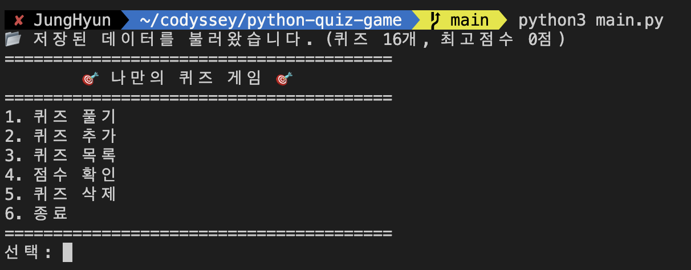 | 6개 메뉴가 정상 표시된 첫 화면 |
| 퀴즈 풀기 | 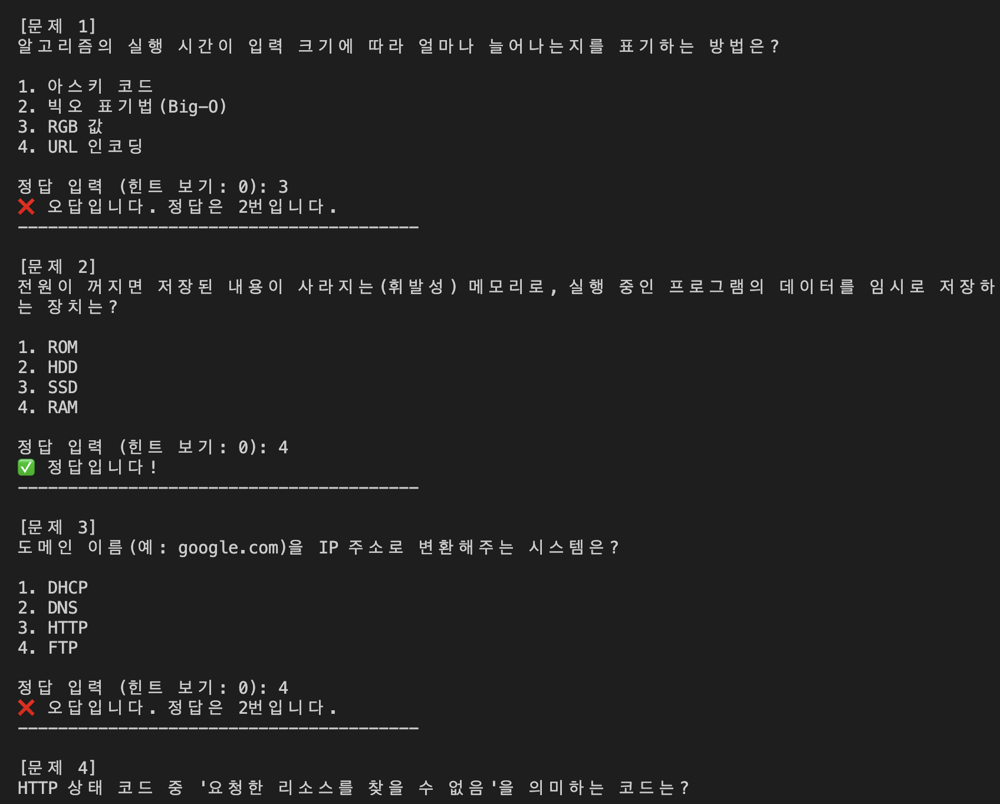 | 문제 출제부터 정답/오답 판정 결과까지 |
| 잘못된 입력 처리 | 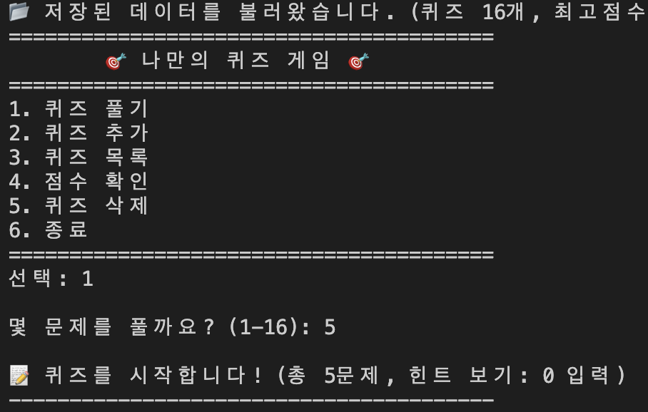 | `abc`, `9`, 빈 입력 등에 대한 오류 메시지 |
| 퀴즈 추가 | 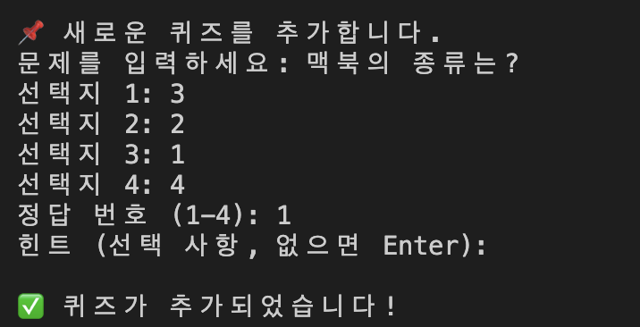 | 입력 과정 + "✅ 퀴즈가 추가되었습니다!" |
| 퀴즈 목록 | 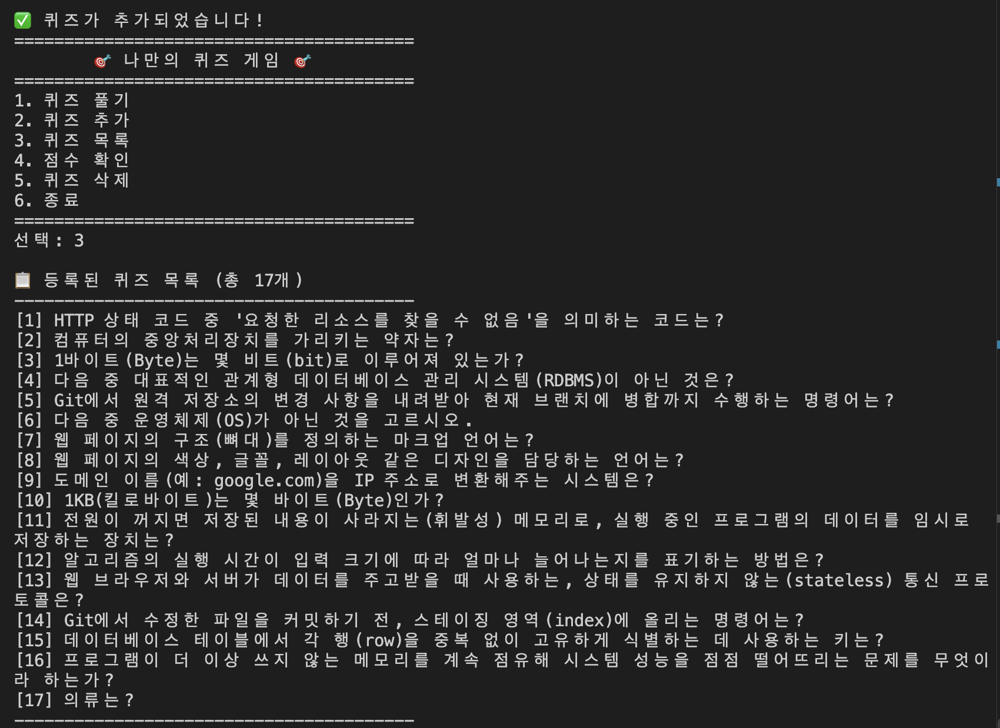 | 등록된 퀴즈 전체 목록 (기본 16문항 + 테스트로 추가한 문항 포함) |
| 점수 확인 | 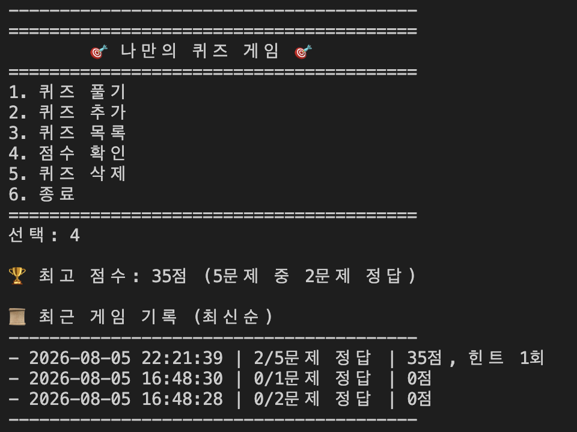 | 최고 점수 + 최근 게임 기록(history) |
| 데이터 유지 — 변경 전 | 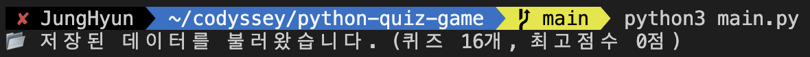 | 퀴즈 추가/플레이 전 상태 (`퀴즈 16개, 최고점수 0점`) |
| 데이터 유지 — 변경 후 | 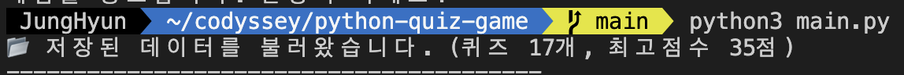 | 퀴즈 추가 + 게임 진행 후 재실행 → 값이 유지됨 (`퀴즈 17개, 최고점수 35점`) |
| `git log` 그래프 | 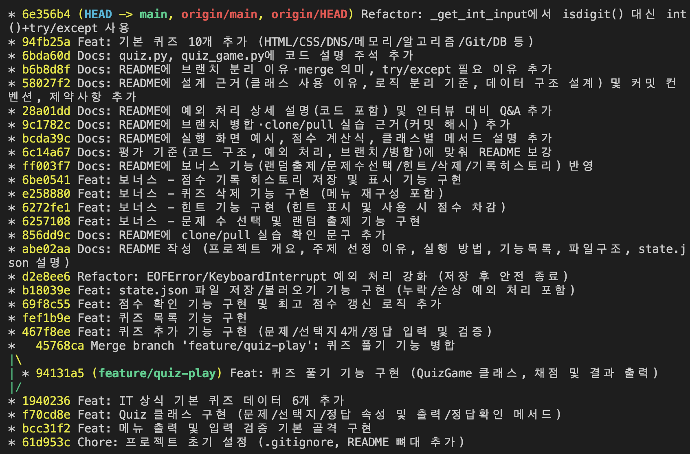 | `git log --oneline --graph` — 브랜치 병합 커밋과 10개 이상 커밋이 보이도록 |
| 개발 환경 — git 설정 명령 |  | `git config --list` 실행 |
| 개발 환경 — git 설정 결과 | 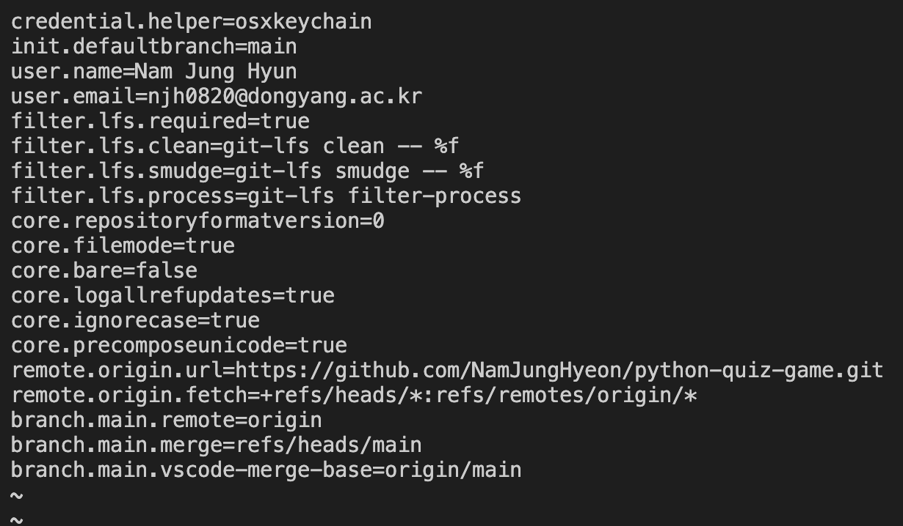 | `user.name`/`user.email`/`remote.origin.url` 등 출력 결과 |
| 개발 환경 — Python 버전 | 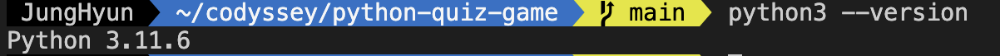 | `python3 --version` → `Python 3.11.6` |
